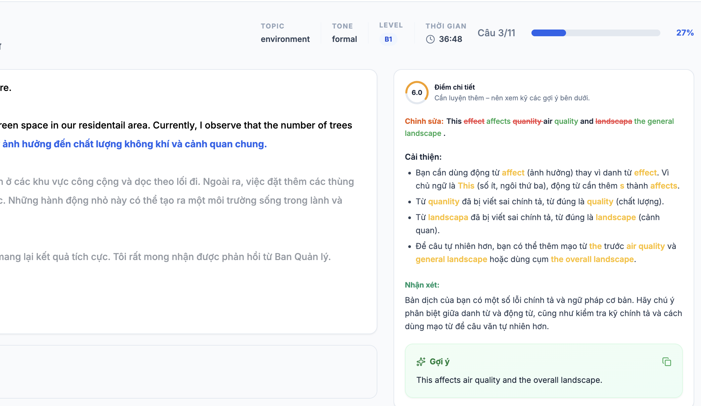
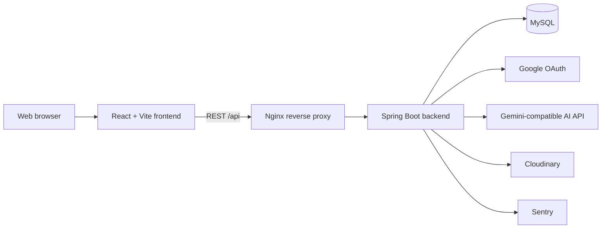
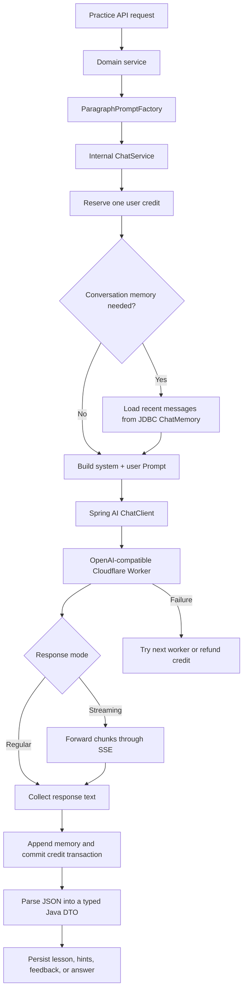

<a href="https://spring.io/projects/spring-boot"></a>
<a href="https://react.dev/"></a>
<a href="https://www.typescriptlang.org/"></a>
<a href="https://www.mysql.com/"></a>
<a href="https://www.docker.com/"></a>

# Fluento (Luyenviet)

Fluento is an AI-assisted language learning platform, presented in the application as **Luyenviet**. It helps learners improve writing and translation through guided exercises, instant feedback, vocabulary review, progress tracking, and multilingual practice.

<p align="center">
  
</p>

## Table of contents

- [✨ Features](#features)
- [🛠️ Architecture](#architecture)
- [🤖 How Spring AI is used](#how-spring-ai-is-used)
- [💻 Technology stack](#technology-stack)
- [📁 Project structure](#project-structure)
- [📋 Prerequisites](#prerequisites)
- [🚀 Getting started](#getting-started)
- [🔧 Environment variables](#environment-variables)
- [🐳 Production deployment](#production-deployment)
- [📚 API documentation](#api-documentation)
- [🔗 References](#references)
- [📧 Contact](#contact)

## ✨ Features

- **AI-powered writing feedback**: Receive contextual grammar corrections, vocabulary suggestions, clarity improvements, and detailed scoring.
- **Flexible practice modes**: Practise individual sentences, structured paragraphs, IELTS tasks, emails, stories, essays, or custom content.
- **Multilingual learning**: Translate between Vietnamese and English, Chinese, or Korean with configurable target languages.
- **Personal vocabulary decks**: Save vocabulary and review it with flashcards, meaning matching, typing, and dictation modes.
- **Learning progress**: Track practice history, scores, completion status, learning time, daily streaks, credits, and coins.
- **Community answers**: Compare translations and learn from other learners' submissions.
- **Leaderboard**: Follow rankings based on practice results and learning consistency.
- **Authentication and authorization**: Support username/password and Google OAuth login with JWT-based access control.
- **Administration portal**: Manage users, roles, paragraphs, sentences, practice records, credit transactions, and learning content.
- **Personalized interface**: English/Vietnamese UI, light/dark themes, onboarding tours, and responsive layouts.

## 🛠️ Architecture



The frontend is a React single-page application. The Spring Boot backend exposes REST APIs under `/api`, applies JWT authentication and role-based authorization, and persists application data in MySQL. In production, Nginx serves the static frontend, terminates HTTPS, and proxies API requests to the backend.

## 🤖 How Spring AI is used

Spring AI is the backend's integration layer between Fluento's learning workflows and an OpenAI-compatible chat API. It provides the `ChatClient`, `OpenAiChatModel`, prompt/message types, reactive streaming, retry exceptions, and JDBC-backed conversation memory used by the application. Domain services do not call an AI provider directly; they depend on the internal `ChatService` abstraction.

### Dependencies and configuration

The backend imports the Spring AI BOM and uses two starters:

- `spring-ai-starter-model-openai` supplies the OpenAI-compatible model and client APIs.
- `spring-ai-starter-model-chat-memory-repository-jdbc` persists conversation memory in MySQL.

The standard provider configuration is defined under `spring.ai` in `application.yml` and `application-hub.yml`. It points the OpenAI-compatible client at Google's Generative Language endpoint:

```yaml
spring:
  ai:
    chat:
      memory:
        repository:
          jdbc:
            initialize-schema: always
            platform: mysql
    openai:
      api-key: ${OPENAI_API_KEY}
      chat:
        base-url: https://generativelanguage.googleapis.com
        completions-path: /v1beta/openai/chat/completions
        options:
          model: ${CHAT_MODEL}
```

`ChatClientConfig` also exposes a default Spring-managed `ChatClient`. The active `@Primary` implementation, `CloudFlareChatService`, currently creates an `OpenAiApi`, `OpenAiChatModel`, and `ChatClient` dynamically for each configured Cloudflare Worker endpoint. This lets Fluento keep the domain layer provider-independent and try another worker when one endpoint is rate-limited or temporarily unavailable. Consequently, `OPENAI_API_KEY` and `CHAT_MODEL` configure the default auto-configured model path; the current worker-based path does not read those two variables directly.

### Request flow



The flow is implemented as follows:

1. A controller delegates the request to a domain service such as paragraph generation, vocabulary hints, or answer preview.
2. `ParagraphPromptFactory` creates separate system and user messages. Prompts include the requested topic, CEFR level, tone, sentence count, and target language.
3. The domain service calls the internal `ChatService`, requesting a concrete Java response type such as `ParagraphAiResponse`, `VocabularyHint[]`, or `SentenceFeedback`.
4. `CloudFlareChatService` creates a Spring AI `Prompt` from `SystemMessage`, previous memory messages when applicable, and `UserMessage`.
5. Spring AI sends the prompt through `ChatClient`. The response is either collected normally with `call()` or consumed incrementally with `stream().content()`.
6. After a complete response is collected, the conversation exchange is appended when memory is enabled and the reserved credit transaction is committed.
7. The returned JSON is cleaned and mapped by Jackson into the requested DTO. The domain service validates/persists the result and returns it to the frontend.

### AI-powered use cases

| Use case | Prompt and output | Persistence/optimization |
| --- | --- | --- |
| Practice content generation | Generates Vietnamese diaries, stories, emails, essays, IELTS tasks, or independent sentences for translation. Output is structured as a title and sentence array. | The paragraph and ordered sentences are saved in MySQL. An existing paragraph with the same setup can be reused to avoid another AI request. Custom user content is split locally and does not call AI. |
| Vocabulary hints | Extracts useful words or phrases and returns translations, part of speech, and pronunciation in English IPA, Chinese pinyin, or Korean romanization. | Results are streamed to the UI and cached per sentence and target language, so later requests reuse the stored hints. |
| Translation feedback | Evaluates the learner's translation and returns a score, corrected sentence, improved version, detailed suggestions, and summary. | Draft feedback is stored with the sentence answer and becomes the submitted answer when the learner confirms it. |
| Adaptive follow-up feedback | Includes recent attempts for the same practice sentence so feedback can remain consistent across previews. | A JDBC message window stores up to 12 messages for each conversation and is cleared after submission. |

### Structured output and prompt design

Fluento asks the model to return JSON-only responses with an explicit schema. This keeps AI output compatible with typed domain objects rather than passing free-form text throughout the application. The prompt factory also applies learning-specific rules:

- Content difficulty follows CEFR-style levels from A2 to C2.
- Generated exercises respect type, topic, tone, requested length, and target language.
- Translation feedback is explained in Vietnamese while corrections remain in the selected target language.
- Vocabulary hints prefer useful phrases and avoid low-value grammar words or proper nouns.
- English, Chinese, and Korean use language-appropriate pronunciation formats.

`CloudFlareChatService` accepts both a raw JSON response and an OpenAI-style completion envelope, removes optional Markdown fences/trailing array commas, and maps the cleaned JSON into the requested Java class. Token usage may be logged when the provider returns it, but the current `ChatResponse` token counters are not yet populated and remain `0`.

### Streaming and conversation memory

Vocabulary hints and answer previews use Spring AI's reactive streaming API. Each model chunk is forwarded to the browser through a Spring MVC `SseEmitter`; after the stream completes, the API sends one final event containing the parsed, persisted result. The security context is propagated into the asynchronous task so credit ownership and authenticated database access still refer to the requesting user.

For repeated answer previews, conversation IDs use the form `preview:{paragraphId}:{practiceId}:{sentenceIndex}`. `MessageWindowChatMemory` loads recent user/assistant exchanges from `JdbcChatMemoryRepository`, limits the context to 12 messages, and adds them between the system prompt and the latest user message. When an answer is submitted, all preview memory for that practice is deleted by prefix.

### Credits, failover, and error handling

Every provider call reserves one credit from the authenticated user before contacting the model. After the provider response is collected successfully, the pending credit transaction is marked as successful. If the provider call fails before that point, the credit is refunded and the transaction is marked as failed.

The worker client disables inner retries and handles failover at the application level. Rate limits, quota exhaustion, and retryable HTTP statuses such as `429`, `502`, `503`, and `504` cause the service to try the next configured worker. Non-retryable failures stop immediately; if no worker succeeds, the failure is propagated to the API layer.

## 💻 Technology stack

| Layer | Technologies |
| --- | --- |
| Frontend | React 19, TypeScript, Vite, Tailwind CSS, Ant Design, TanStack Query, Zustand, i18next |
| Backend | Java 21, Spring Boot 3.2, Spring Security, Spring Data JPA, Spring AI, OpenAPI |
| Database | MySQL 8, versioned SQL migration files |
| Integrations | Google OAuth 2.0, Gemini-compatible AI API, Cloudinary, Sentry |
| Infrastructure | Docker, Docker Compose, Nginx, GitHub Actions |

## 📁 Project structure

```text
fluento/
├── backend/                 # Spring Boot REST API
│   └── src/main/
│       ├── java/com/nta/    # Domain, security, services, and controllers
│       └── resources/       # Runtime config and database migrations
├── frontend/                # React + Vite single-page application
│   └── src/                 # Features, entities, shared UI, and translations
├── nginx/                   # Production reverse proxy and TLS configuration
├── tests/                   # Performance and benchmark tests
├── docker-compose.yml       # Local container definitions
└── docker-compose.hub.yml   # Image-based production stack
```

## 📋 Prerequisites

- [Java 21](https://adoptium.net/)
- [Node.js 18+](https://nodejs.org/)
- [MySQL 8](https://dev.mysql.com/downloads/mysql/) or Docker
- [Docker and Docker Compose](https://docs.docker.com/compose/) for containerized database/deployment workflows

## 🚀 Getting started

### 1. Clone the repository

```bash
git clone https://github.com/ntheanh-dev/fluento.git
cd fluento
```

### 2. Start MySQL

Use an existing MySQL 8 instance, or start one with Docker:

```bash
docker run --name luyenviet-mysql \
  -e MYSQL_DATABASE=luyenviet \
  -e MYSQL_ROOT_PASSWORD=your_password \
  -p 3306:3306 \
  -d mysql:8.0
```

### 3. Start the backend

```bash
cd backend

SPRING_DATASOURCE_URL="jdbc:mysql://localhost:3306/luyenviet?useSSL=false&allowPublicKeyRetrieval=true" \
SPRING_DATASOURCE_USERNAME=root \
SPRING_DATASOURCE_PASSWORD=your_password \
OPENAI_API_KEY=your_ai_api_key \
CHAT_MODEL=your_model_name \
./mvnw spring-boot:run
```

The API starts at [http://localhost:8080/api](http://localhost:8080/api).

### 4. Start the frontend

In another terminal:

```bash
cd frontend
npm ci
npm run dev
```

Open [http://localhost:5173](http://localhost:5173).

On first backend startup, the application creates the required roles and a local administrator account. For shared or production environments, replace all default development credentials before use.

## 🔧 Environment variables

Create `frontend/.env.local` for frontend overrides:

```dotenv
VITE_API_URL=http://localhost:8080/api
VITE_GOOGLE_CLIENT_ID=your_google_client_id
VITE_GOOGLE_REDIRECT_URI=http://localhost:5173/oauth/authenticate
VITE_GOOGLE_AUTH_URI=https://accounts.google.com/o/oauth2/v2/auth
VITE_SITE_URL=http://localhost:5173
```

The backend can be configured through standard Spring environment variables. The most relevant values are:

| Variable | Purpose | Required for |
| --- | --- | --- |
| `SPRING_DATASOURCE_URL` | MySQL JDBC connection URL | Backend startup |
| `SPRING_DATASOURCE_USERNAME` | MySQL username | Backend startup |
| `SPRING_DATASOURCE_PASSWORD` | MySQL password | Backend startup |
| `MYSQL_ROOT_PASSWORD` / `DB_PASSWORD` | MySQL and backend database passwords | Production Compose stack |
| `JWT_SIGNER_KEY` | Signs and verifies JWT access tokens | Authentication |
| `API_KEY_ENCRYPTION_SECRET` | Encrypts user-managed API key data | Production backend |
| `GOOGLE_CLIENT_ID` | Google OAuth client ID | Google login |
| `GOOGLE_CLIENT_SECRET` | Google OAuth client secret | Google login |
| `OPENAI_API_KEY` | API key for the Gemini-compatible endpoint | AI practice and feedback |
| `CHAT_MODEL` | AI chat model name | AI practice and feedback |
| `CLOUDINARY_CLOUD_NAME` | Cloudinary cloud name | Avatar uploads |
| `CLOUDINARY_API_KEY` | Cloudinary API key | Avatar uploads |
| `CLOUDINARY_API_SECRET` | Cloudinary API secret | Avatar uploads |
| `CORS_ALLOWED_ORIGINS` | Allowed frontend origins | Cross-origin requests |
| `SENTRY_DSN` | Sentry project DSN | Production monitoring |

Never commit real credentials or API keys. Keep local secrets in ignored environment files and rotate any credential that is accidentally exposed.

## 🐳 Production deployment

The production stack pulls versioned backend, frontend, and Nginx images and runs them with MySQL:

```bash
docker compose --env-file .env.production -f docker-compose.hub.yml pull
docker compose --env-file .env.production -f docker-compose.hub.yml up -d
```

The stack exposes HTTP on port `80` and HTTPS on port `443`. Before starting it, provide the required variables in `.env.production` and place the origin certificate files described in [`nginx/certs/README.md`](./nginx/certs/README.md) under `nginx/certs/`.

Useful commands:

```bash
docker compose --env-file .env.production -f docker-compose.hub.yml ps
docker compose --env-file .env.production -f docker-compose.hub.yml logs -f
docker compose --env-file .env.production -f docker-compose.hub.yml down
```

## 📚 API documentation

With the backend running locally:

- Swagger UI: [http://localhost:8080/api/swagger-ui/index.html](http://localhost:8080/api/swagger-ui/index.html)
- OpenAPI JSON: [http://localhost:8080/api/v3/api-docs](http://localhost:8080/api/v3/api-docs)
- Health check: [http://localhost:8080/api/actuator/health](http://localhost:8080/api/actuator/health)

## 🔗 References

- [Spring Boot Documentation](https://docs.spring.io/spring-boot/)
- [React Documentation](https://react.dev/)
- [Vite Documentation](https://vite.dev/)
- [Docker Documentation](https://docs.docker.com/)
- [MySQL Documentation](https://dev.mysql.com/doc/)

## 📧 Contact

If you have questions or would like to contribute, contact the maintainer:

<a href="mailto:anhthenguyen.work@gmail.com">
  
</a>
<a href="https://www.linkedin.com/in/anhthenguyen204/">
  
</a>

<p align="right"><a href="#fluento-luyenviet">🔼 Back to top</a></p>
